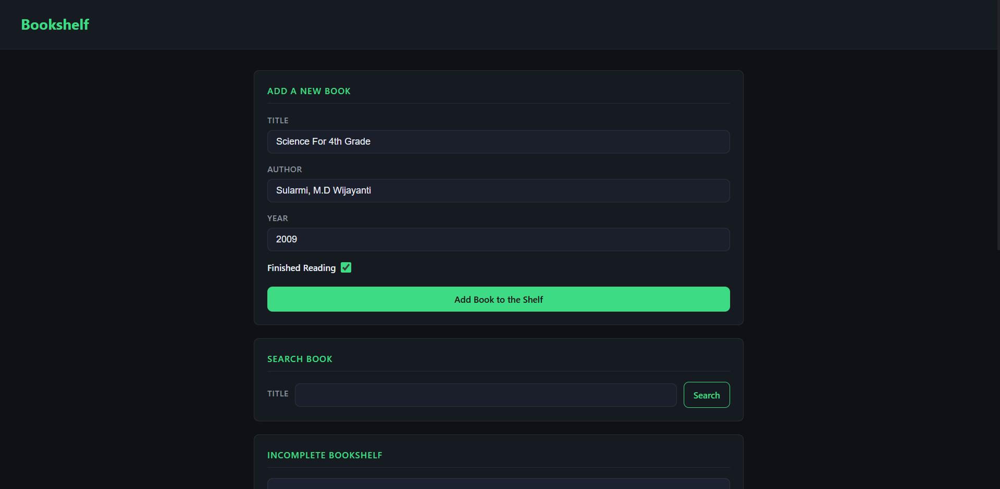
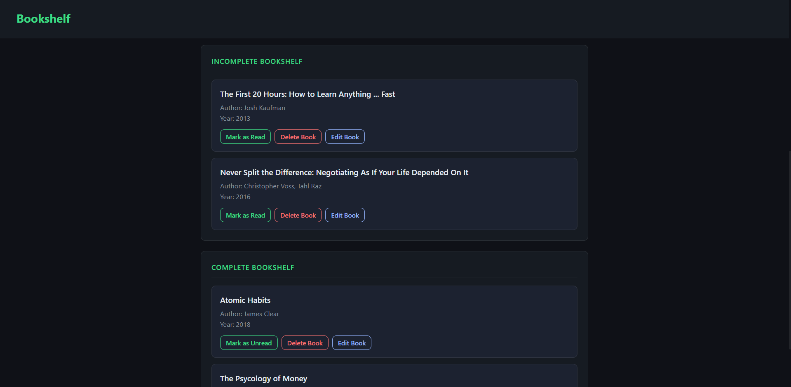
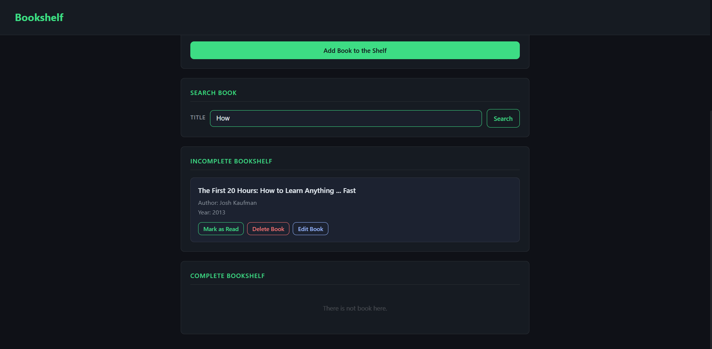

# 📚 Bookshelf (Web JS)

  
<br>
 

Bookshelf is a clean, interactive web-based book list management application. It empowers users to easily track books they are currently reading and those they have already finished. 

This project is built purely with **Vanilla JavaScript** and utilizes the **Web Storage API (LocalStorage)**, ensuring that your book library data persists securely in the browser even after a page refresh or closure.

---

## 📸 Preview

<div align="center">

| Add New Book | Shelves | Search Function |
|:---:|:---:|:---:|
|  |  |  |

</div>

---

## ✨ Key Features

* **Full CRUD Operations:** Add, Read, Update, and Delete book entries effortlessly.
* **Dual-Shelf System:** Automatically categorizes books into "Not Yet Finished" and "Finished Reading" shelves.
* **Seamless State Toggling:** Move books between shelves with a single click.
* **Smart Search:** Quickly find specific books by their title using real-time search filtering.
* **Data Persistence:** All book data is safely saved to the browser's `localStorage`.
* **Safe Deletion:** Includes a confirmation pop-up before deleting a book to prevent accidental data loss.
* **Dark Mode UI:** Features a modern, eye-friendly interface utilizing a dark theme aesthetic.

---

## 🛠️ Technology Stack

* **HTML5:** Semantic web page structure for better accessibility and SEO.
* **CSS3:** Custom styling utilizing CSS Variables, Flexbox for layout management, and responsive design principles.
* **Vanilla JavaScript:** Core application logic handling DOM manipulation, Event Listeners, and data binding.

---

## 🚀 Installation & Usage

**🌐 Play with the Live Version:**
You can try the application immediately without downloading anything by visiting the **[Live Demo](https://amaradism.github.io/bookshelf-web-js/)**.

**💻 Run Locally:**
If you want to view or modify the code on your local machine, this application is completely client-side. You don't need to install any Node.js dependencies.

1. **Clone the repository:**
   ```bash
   git clone https://github.com/amaradism/bookshelf-web-js.git
   ```
2. **Navigate to the project folder:**
   ```bash
   cd bookshelf-web-js
   ```
3. **Run the app:**
   Simply double-click the `index.html` file to open it in your default web browser, or use a tool like VS Code's *Live Server* extension.

---

## 📁 Folder Structure

```text
bookshelf-web-js/
├── assets/
│   └── screenshots/
├── css/
│   └── style.css
├── js/
│   └── main.js
├── index.html
└── README.md
```

---

## 💡 Educational Scope

This project was specifically developed to practice and demonstrate fundamental frontend web development concepts, including:
* **Client-Side Data Persistence:** Implementing Web Storage API.
* **Advanced Array Manipulation:** Utilizing JavaScript array methods like `.filter()`, `.find()`, and `.splice()`.
* **Dynamic DOM Manipulation:** Creating, rendering, and removing HTML elements dynamically via JavaScript.
